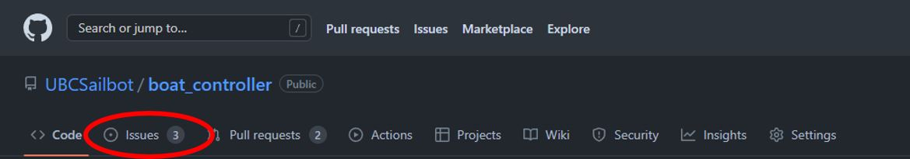
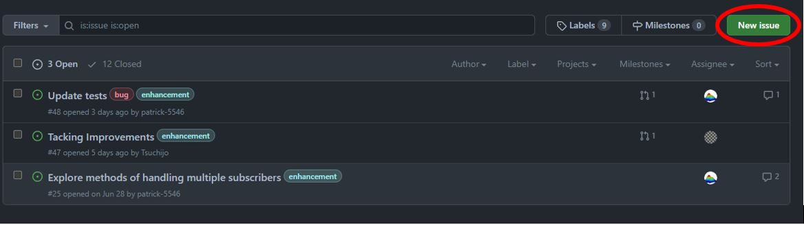
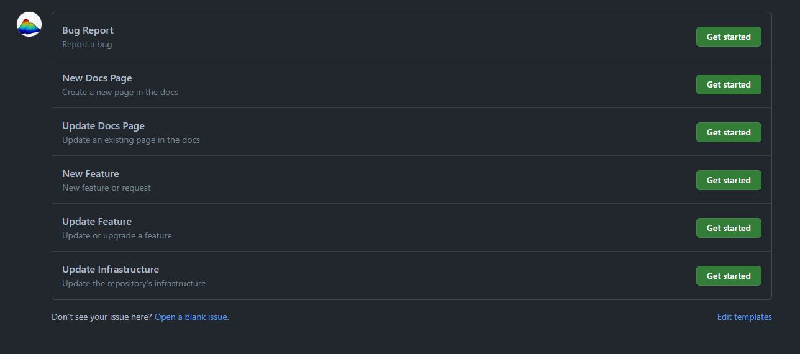
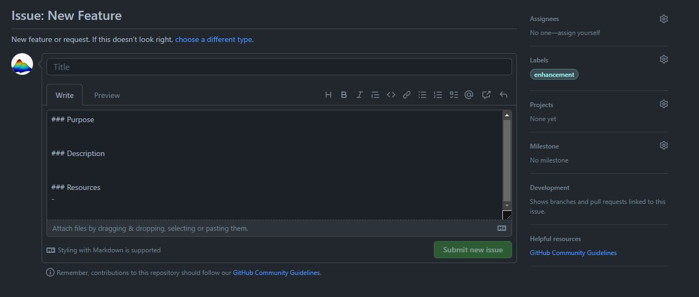
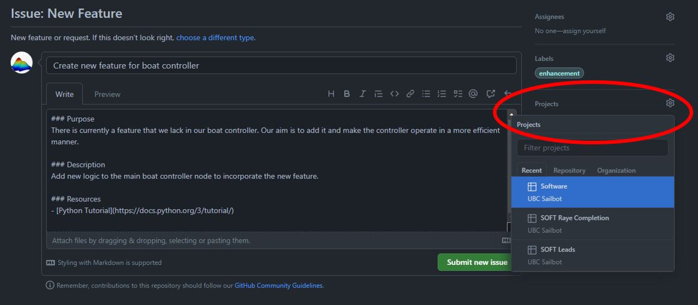
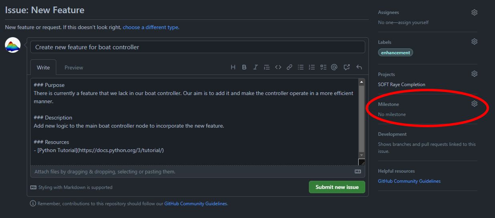
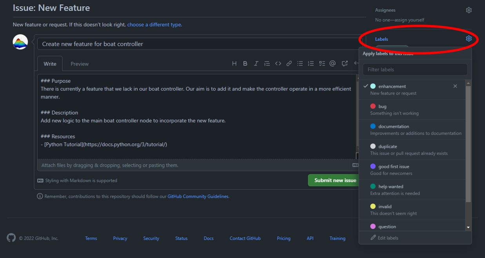
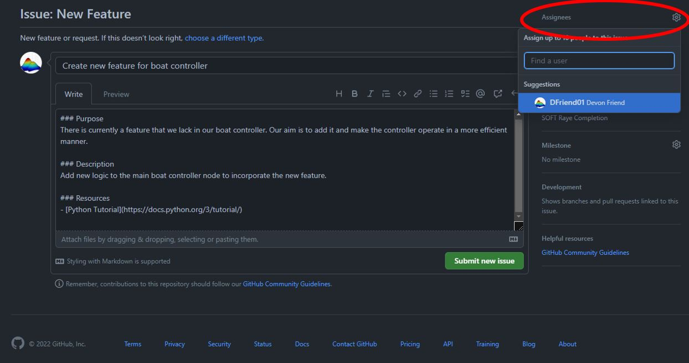

# Creating Issues

GitHub issues lets us plan and track our work on GitHub.

## Getting started with issue templates

An issue is associated with a specific repository. To open the issues page for a given repository, click on
the issues tab in the repository navigation bar.

You will see a list of current issues (if any) for the repository. To create a new issue, click on the
`New issue` button in the upper right corner.

When creating a new issue, you will see a few issue templates. Since issues can be created for a variety of reasons,
issues may therefore be structured differently and contain different kinds of information. Issue templates were
introduced to give us a quick and structured way to writing issues.

!!! note

    GitHub issues are written using GitHub-flavoured markdown. To add a little spice to your issues, refer
    to the official [GitHub documentation](https://docs.github.com/en/get-started/writing-on-github){target=_blank} 
    for some quick tips and tricks on how to write awesome markdown!

Click on the `Get started` button to open the issue template. For this example, let's go with the `New Feature`
issue template. Upon opening the issue template, you should see a page like the one below:

At this point, you should give a succinct title and describe the issue in the textbox. You will also see some templated
sections to fill out. Try to give only the necessary details to make a clear and concise issue. If you are unsure on how
to construct your issue, take a look at current or past issues and ask the software leads for further guidance if necessary.

Finally, feel free to [make suggestions](https://github.com/UBCSailbot/.github/issues/templates/edit){target=_blank}
on new templates or changing current templates!

!!! tip

    We understand that some issues may need extra sections to describe the issue further, or some of
    the templated sections might not be relevant at all! Add or remove sections as necessary to get your
    point across. The goal of the issue templates is to provide guidance, not police your documentation
    methodologies!

## Adding issues to a project

We use projects to plan and track the status of our issues and pull requests.
To add an issue to an existing project, click on the gear icon in the `Projects` section and add it to your desired
project. You will almost always want to add your issue to the Software organization project.

To verify that your issue has been added to your desired project, go to the UBC Sailbot organization, go
to the `Projects` tab on the organization banner, and select the project that it is added to. When added
to a project, it should show up under the `General` tab (depending on the project, this might not always
be the case).

## Adding issues to a milestone

We use milestones to track progress on groups of issues or pull requests that we want to complete by a certain date.
Since our projects span over many years, it is important to work incrementally with small,
yet achievable goals. If your issue should belong to a milestone, simply add it to a milestone by clicking
on the gear icon in the `Milestone` section and add it to your desired milestone.

!!! note

    Unlike projects, milestones are strictly associated with a repository.

## Labelling issues

GitHub allows us to label our issues so that we can categorize them. It helps us identify at first glance what
kind of a problem that an issue aims to solve and which issues are more important. To add a label to your issue,
click on the gear icon in the `Labels` section and add your desired label(s).

The issue templates will already have labels assigned to them, but you should add or remove labels as you see fit
to make them as relevant as possible.

!!! note

    Each repository might have different labels available, so be sure to check out all of the labels
    at least once in the repository that you are working in. Feel free to suggest additional labels
    as well!

## Adding assignees

Every issue should be assigned to at least one person to work on it. If you are not sure who should be assigned
the issue initially, then don't worry about it for now since you can assign someone to the issue later on. To
assign someone an issue, click on the gear icon in the `Assignees` section and add the desired people.

## Submit the issue

Once you are finished writing your issue, click on the `Submit new issue` button. You should now see your issue
in the issues list and in the UBC Sailbot software project.
