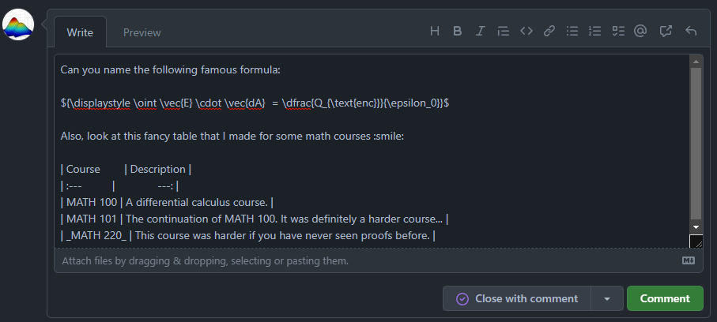
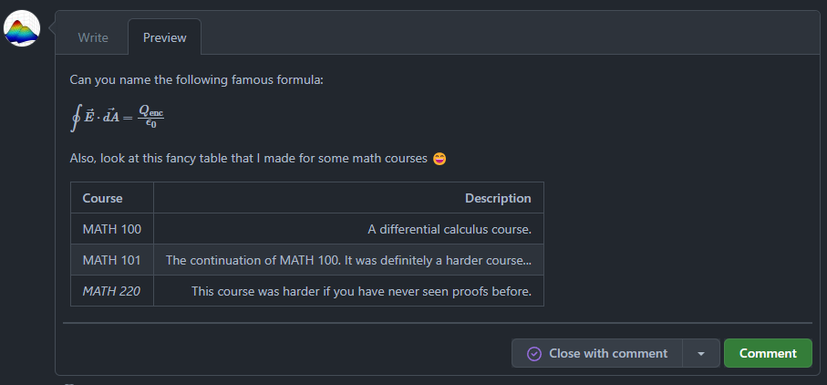

# Markdown

Markdown is a lightweight markup language that you can use to add formatting elements to plaintext text documents.[^1]
You can do anything with Markdown, from creating websites to PDF documents, all in a clean format that is easy to
learn. [Many of your favorite services use Markdown](https://www.markdownguide.org/tools/){target=_blank}, so it would
be useful to pick it up to write technical documentation.

Markdown is not standardized across services. Many services that support Markdown have their
own "flavour" of Markdown. Be sure to know the Markdown features of the service
you are using so that your Markdown renders properly.

## Getting Started

We recommend [markdownguide.org](https://www.markdownguide.org/){target=_blank} to be your first point of reference if\
you are learning Markdown for the first time. It covers topics like what Markdown is, its syntax, advanced tips, and the
different services that support Markdown. Flavours of Markdown specific to a service build on top of these basics.

## Sailbot and Markdown

We write Markdown for GitHub and Material for MkDocs. The following sections
detail how Markdown is used in these services.

### GitHub

We use Markdown in GitHub for technical documentation and collaboration. This includes:

- `README.md` files
- Issues
- Pull Requests

Almost all places where text is written in GitHub support Markdown. GitHub also allows you to preview
your Markdown before you submit any comments.

=== "Before Rendering"

    

=== "After Rendering"

    

The image above shows an example of a "write" and a "preview" tab for writing a comment on an issue. It might look
different depending on where you are writing, but there usually exists a preview option!

!!! note "GitHub-Flavoured Markdown"

    GitHub uses its own "flavour" of Markdown. Certain features, like using HTML, are excluded for security reasons.
    Visit the [official GitHub Markdown guide](https://docs.github.com/en/get-started/writing-on-github){target=_blank}
    for more information on the available features.

### Material for MkDocs

We use Markdown in Material for MkDocs to create this website! Since it is written in Markdown, no frontend
experience is required to contribute to our docs.

Material for MkDocs supports powerful features purpose-built to take technical documentation to the next level.
Feel free to browse this site to see how we use these features, exploring their syntax in the
[source code](https://github.com/UBCSailbot/docs/tree/main/docs){target=_blank}. Since GitHub renders Markdown files automatically
you will need to click the "Raw" button to view their contents.

!!! note "Material-Flavoured Markdown"

    Material for MkDocs' flavour of Markdown extends upon vanilla Markdown, adding features such as admonitions 
    (like this note) and content tabs. Refer to the
    [official Material for MkDocs reference page](https://squidfunk.github.io/mkdocs-material/reference/){target=_blank}
    for more information on the available features.

## Rendering Markdown

You have a few choices to render Markdown on your computer.
Be advised that if you are using an extended version of Markdown, you will
need to consult the documentation from the service provider to render their flavour of Markdown properly. The following
resources are good for rendering Markdown:

=== ":simple-markdown: Vanilla"
    - [VS Code](https://code.visualstudio.com/docs/languages/markdown#_markdown-preview){target=_blank}: Markdown
    rendering is supported
    out of the box.
    - [Markdown Live Preview](https://markdownlivepreview.com/){target=_blank}: An online rendering tool.

=== ":simple-github: Github"
    - [Markdown Preview GitHub Styling](https://marketplace.visualstudio.com/items?itemName=bierner.markdown-preview-github-styles){target=_blank}:
    VS Code extension that renders GitHub-flavoured markdown.
    - Create a draft issue on GitHub and preview the markdown to see how it renders.

=== ":logo: Material for MkDocs"
    - UBC Sailbot Docs: To preview your changes when working on this site,
    refer to the [run instructions in the `README.md`](https://github.com/UBCSailbot/docs#run){target=_blank}.
    - Material for MkDocs sites in general: If you ever decide to write your own documentation using Material for MkDocs,
    refer to the [official "Getting Started" guide](https://squidfunk.github.io/mkdocs-material/getting-started/){target=_blank}.

Other resources exist to render Markdown like browser extensions that render Markdown as HTML and GitHub repositories
that contain source code to render your Markdown. Feel free
to browse around for the solution that suits your needs.

## Linting

We lint our Markdown files to reduce errors and increase readability. In particular, we use two tools:

1. [markdownlint](https://github.com/DavidAnson/markdownlint){target=_blank} is
used to enforce a style guide. Its configuration file for this repository is [`.markdownlint.json`](https://github.com/UBCSailbot/docs/blob/main/.markdownlint.json){target=_blank}.
If you use VS Code, there is a [markdownlint extension](https://marketplace.visualstudio.com/items?itemName=DavidAnson.vscode-markdownlint){target=_blank}.

2. [markdown-link-check](https://github.com/tcort/markdown-link-check){target=_blank} is
used to check for broken links. Its configuration file for this repository is [`.markdown-link-check.json`](https://github.com/UBCSailbot/docs/blob/main/.markdown-link-check.json){target=_blank}.

[^1]: <https://www.markdownguide.org/getting-started/>
