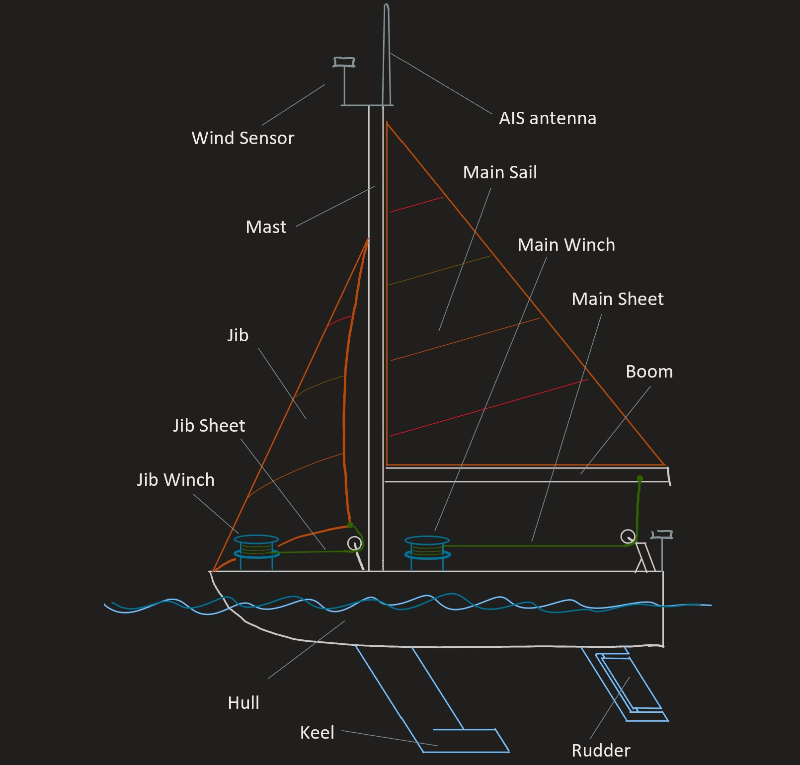
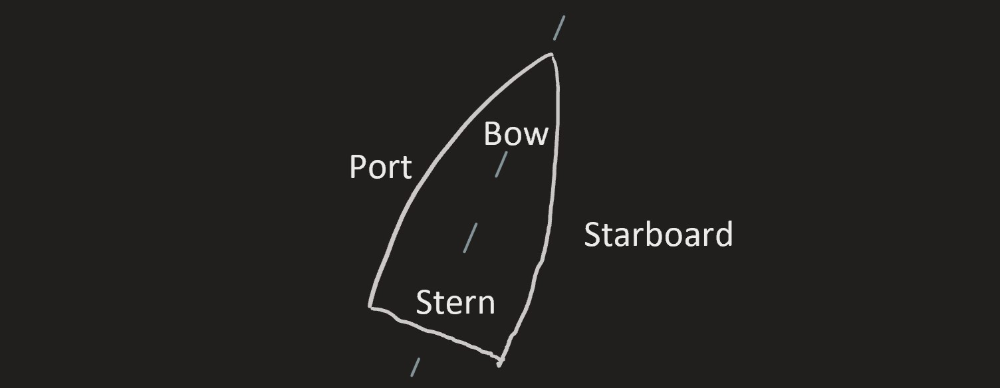

# Parts of a Sailboat

This page names some important parts of a sailboat, and explains what the part is for.
Read the descriptions of the parts below, and refer to the image to see where the part fits in.

## Hull

The ***Hull*** is the "boat" part of the boat, which displaces water to create buoyancy. The following parts of the boat
are attached to the hull:

- ***Keel***: The keel has a large mass on the end, which keeps the sailboat upright. The fin-like shape of the
keel provides *lateral resistance* to prevent the boat from slipping sideways through the water.
- ***Rudder***: Raye has two rudders for redundancy. The rudders can angle side to side to steer the boat.
To steer the boat effectively, the rudders need enough water flowing over them to create a pressure difference when they
angle sideways. Controls sends commands to the rudder to steer the boat.

It is also helpful to know the names of the following "regions" of the hull:

- ***Bow***: The front of the boat.
- ***Stern***: The back of the boat.
    - *Aft* means "backwards towards the stern".
- ***Starboard***: The side of the boat which is on the **right**, for someone standing on the boat facing the bow.
- ***Port***: The side of the boat which is on the **left**, for someone standing on the boat facing the bow.
    - To remember which is which between starboard and port, remember that "port" and "left" both have 4 letters.

The image below shows a birds-eye view of the outline of a hull of a sailboat,
where the "regions" of the hull are labeled.

## Jib

The ***Jib*** is the sail located near the bow, and is the smaller of the two sails.

- *Jib Sheet*: In general, *sheets* are ropes that pull a sail in to the boat, and the jib sheet does this for the jib.
On Raye, the jib sheet connects to the back bottom corner of the jib, through a pulley near the bottom of the mast to
the Jib Winch. Most sailboats have two jib sheets, one on either side, but Raye is designed differently for autonomy.
- The ***Jib Winch*** is a motor-driven device that tightens or pulls in the jib by pulling on the jib sheet.
Controls sends commands to the winches.
- The *jib halyard*: In general, a *halyard* is a rope that pulls a sail up. The jib halyard pulls up the jib.
It connects to the top of the jib, runs through a pulley near the top of the mast, and is tied off
near the bottom of the mast.

## Mast

The ***Mast*** is the long vertical pole which connects to hull. It holds up the sails and some instruments.

The following instruments are at the top of the mast:

- One of the 3 ***Wind Sensors***. The top of the mast is a good location to measure undisturbed wind.
Pathfinding and Controls both use data from the wind sensors.
- The ***AIS antenna***. AIS ("Autonomous Identification System") is a system by which ships
communicate their location, speed, and other information to surrounding ships via radio signals.
Pathfinding uses AIS data to avoid other ships.

The mast is held upright by three lines:

- The *forestay* connects the mast from the top of the jib to the bow, and runs parallel to the front edge of the jib.
- The two *shrouds* connect the mast from the top of the jib to the outside edges of the hull slightly aft of the mast.
There is one shroud on the startboard side and one on the port side.

## Main Sail

The ***Main Sail*** is the larger of the two sails, and is located aft of the mast.
Most of the boat's propulsion comes from the main sail.

- The *Boom* is the horizontal pole that holds the bottom corner of the main sail out from the mast.
- *Main Sheet* is the rope that pulls the main sail in towards the center of the boat. It connects from the back end of
the boom, through a pulley on the stern, to the Main Winch.
- The ***Main Winch*** is a motor-driven device that pulls in the main sail by pulling on the main sheet.
Controls sends commands to the main winch.
- The *main halyard* is the line used to hoist the main sail.

## Conclusion

Hopefully this section helped you gain familiarity with some common sailing terms.
It likely feels like this section contains a lot of new information. It's unrealistic to remember it all perfectly,
but make an effort to remember the terms which are ***Bolded and Italicized***.

## Keywords on this Page

- Hull
- Keel
- Rudder
- Bow
- Stern
- Starboard
- Port
- Jib
- Jib winch
- Mast
- Wind Sensor
- AIS Antenna
- Main Sail
- Main Winch
