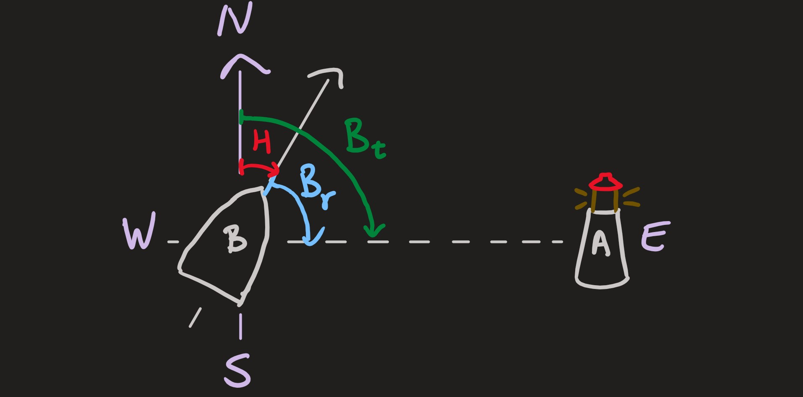
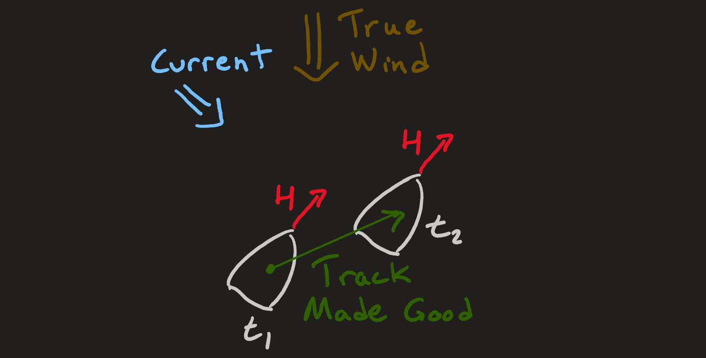
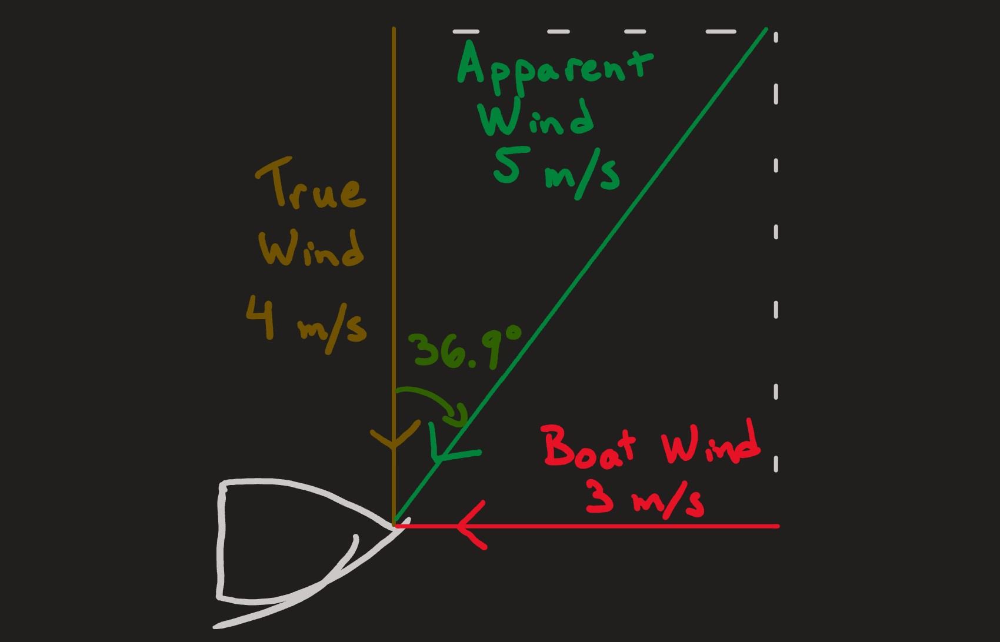
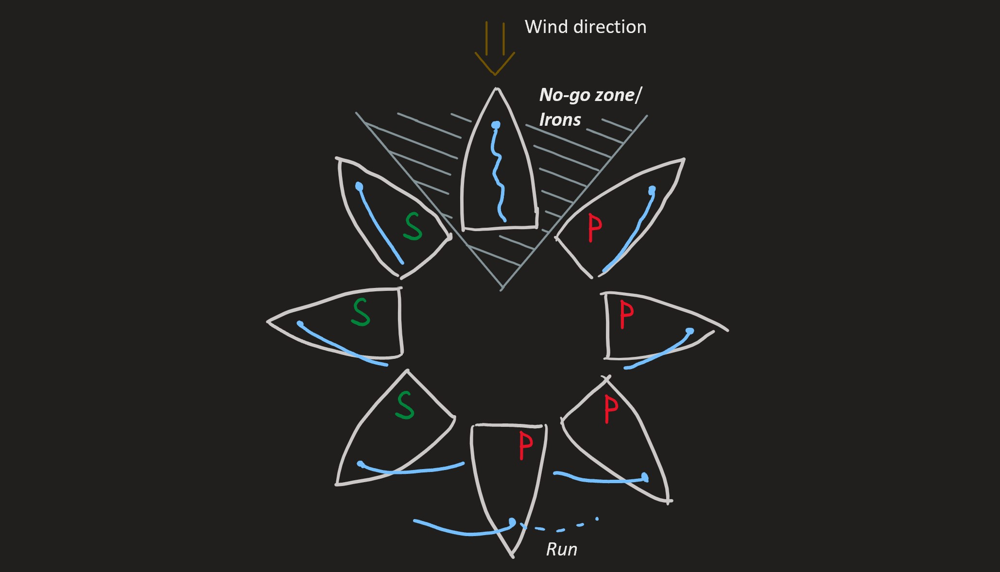

# Miscellaneous Sailing Knowledge

This section covers some other useful information.

## Wind Direction Convention

Generally speaking, there are two ways to use an angle to describe the wind direction.

1. The angle tells you which way the wind is **blowing towards**. For example, 0° means the wind is blowing from North
to South.
2. The angle tells you which way the wind is **coming from**. For example, 0° means the wind is blowing from South to North.

In sailing, we normally talk about "where the wind is **coming from**". Somehow this ends up being more intuitive when
talking about maneuvers or sail angle adjustments.

However, when describing the wind as a vector, it can make more sense for the vector to represent the actual
speed and direction the air is flowing. Make sure to document which convention you are using in your work when
its applicable, and don't be afraid to ask someone to clarify which convention they are using in their work.

## Navigation Terms

### Heading

In navigation generally (outside of Sailbot), the ***Heading*** is the direction the bow of the boat is pointing
towards. Headings are typically (but not always at Sailbot) measured relative to true North in the clockwise direction.

### Bearing

A ***Bearing*** is used to describe one point in relation to another: the Bearing of point "A" from point "B"
is the direction you would would look towards if you wanted to see point "A" while standing at point "B". A *Range*
is the distance between points "A" and "B", so that a Bearing and Range together can locate point "A" relative to point
"B" in polar co-ordinates. There are two main ways of measuring bearings:

- A *True Bearing* is a bearing where the angle convention is as follows: 0° is towards the **North**,
angles increase in the clockwise direction, and angles are typically bounded within [0°, 360°)]
- A *Relative Bearing* is a bearing where the angle convention is as follows: 0° is **straight forwards relative to the
boat**, and angle measurements increase in the clockwise direction. Angles may be bounded in [-180°, 180°) or [0°, 360°)

In the example below, the boat "B" has a Heading (H) of 30°. The True Bearing ($B_t$) of the Lighthouse "A"
from the boat is 90°. The Relative Bearing ($B_r$) of the lighthouse from the boat is 60°.

### Track Made Good

Boats do not necessarily travel in the same direction as their ***Heading***, due to the effects of ocean current and
wind. The path the boat has traveled relative to the sea floor is called the ***Track Made Good***. This is the
same as if you measured motion compared to land or with a GPS.

### Heading and Bearing in Raye Project

In Sailbot's Raye project, ***Heading*** and ***Bearing*** are used to refer to different conventions for describing
which way the boat is pointing.
The following 3 pieces of information are needed to unambiguously define an angle measuring convention:

- What does 0° mean? If 0° is North, is it **towards** the North or **away** from the North?
- Do the angle measurements increase in the clockwise or counter-clockwise direction?
- What range should the angles be bounded to? This part is often unimportant if the angles are only used in
trigonometry functions.

Some common examples of angle measuring conventions which we use are:

- 0° means towards the East, angles increase in the counter-clockwise direction, and angles are bounded in
[-180°, 180°). This is effectively the main angle convention used in most math courses.
- 0° means towards the North, angles increase in the clockwise direction, and angles are bounded in [0°, 360°). This
angle convention is more commonly used by navigators.

The specific angle conventions which we call Heading and Bearing can be ambiguous, and may be subject to change,
so they are deliberately omitted here. Refer to the applicable source code to determine what the angle conventions are.

## True, Apparent, and Boat Wind

- *True Wind* is the wind vector (speed and direction) which you would measure while standing on land (or motionless at
sea with unchanging GPS co-ordinates). In sailbot code, this may be referred to as ***Global Wind***. When people
refer to "the wind", they normally mean True Wind.
- *Boat Wind* is the wind vector which you would measure while standing on a moving boat when the True Wind speed is 0.
This means that boat wind always blows straight onto the bow of the boat, and the magnitude of the boat wind is equal to
the speed of the boat.
- ***Apparent Wind*** is the vector sum of the True Wind and the Boat Wind. This is the wind that you would measure while
standing on a moving boat more generally, even if there is non-zero wind. The apparent wind is also what our wind
sensors measure, and what our sails feel. In Sailbot code, Apparent Wind may be referred to as ***Measured Wind***.

In the example below, suppose the wind is blowing from the North at 4 m/s, and suppose the boat is moving **towards**
the East at 3 m/s.

- The True Wind everywhere is blowing at 4 m/s from the North
- The Boat Wind onboard the boat is blowing **from** the East at 3 m/s
- The Apparent Wind onboard the boat is has a magnitude of $\sqrt{3^2 + 4^2} = 5 \text{ m/s}$,
and is coming from a true bearing of $\arctan{(\frac{3}{4})} = 36.9°$.

## Tack

In the [Types of Turn](./turning.md#tacking)
page, we discussed how a ***Tack*** is a type of turn. Weirdly, the word "tack" actually has two
more distinct meanings in sailing. The word "Tack" can refer to:

- the type of turn, as covered before.
- *Starboard Tack* vs *Port Tack*: The tack is basically the side of the boat which is further upwind. More thoroughly,
the tack is the opposite side to the sail. This means that boats change tack when the sail switches sides.
    - In the diagram below,
    the 3 boats on the left of the diagram are on Starboard Tack, and the 3 boats on the right side are on Port Tack.
    - The tack of a boat in *Irons* is undefined.
    - The boat in the diagram on a run is on Port Tack. If the boat continued straight but the sail switched sides into
    the position shown by the **dashed** line, the boat would be on Starboard Tack.

- Finally, the Tack can refer to particular region of the main sail. This is not important for software members.

## Keywords on this Page

- Heading
- Bearing
- Track Made Good
- Global Wind (aka True Wind)
- Measured Wind (aka Apparent Wind)
- Tack
