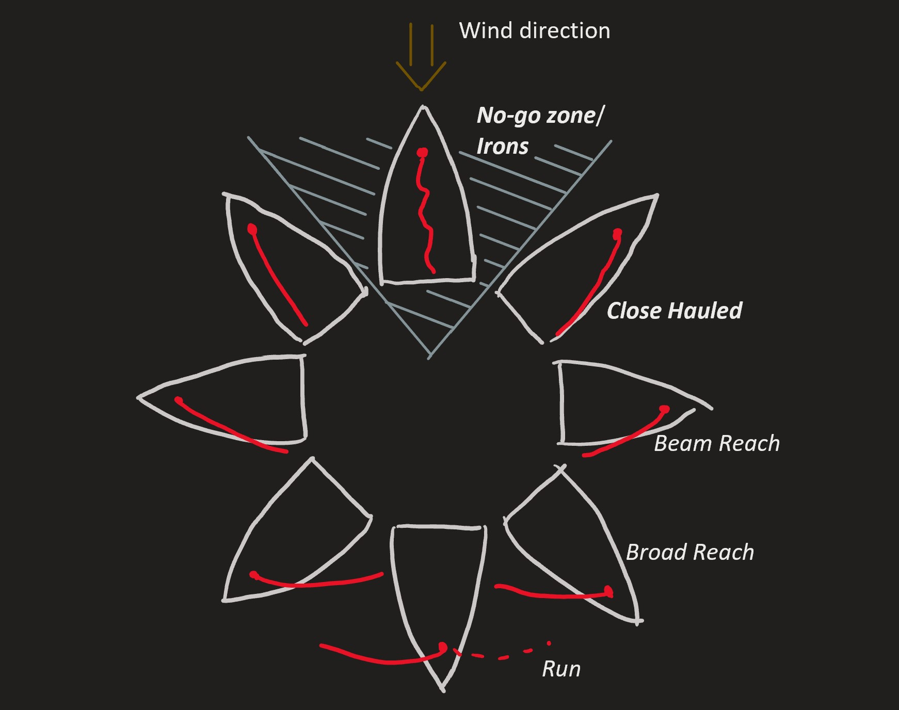
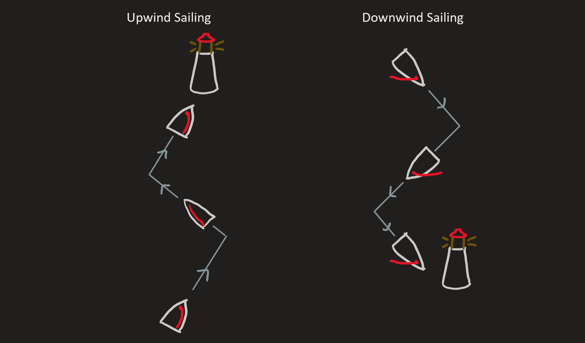

# Points of Sail

In sailing, we sometimes talk about different angles that we can sail on with
respect to the wind. Ranges of angles which are close together have special
names. These ranges are called *points of sail*.
The discussion below coveres the most important points of sail for software
members to understand.

Sailbot wind angles use the flow-toward convention. A boat heading aligned with
the airflow is directly downwind; a heading opposite the airflow is directly
upwind.

Notice how for *higher* points of sail (points of sail closer to straight into
the wind), the sail is pulled tightly in to the boat. If the boat is on a
*lower* point of sail, the sails should be let further out of the boat. For
any point of sail, there is an optimum angle that the sail should be adjusted
to. If the sails are adjusted too far in or too far out, the boat will not go
as fast as it could if the sails were adjusted correctly.

## Irons

The range of angles where the boat points roughly against the airflow is called
***Irons***, or the upwind ***No-Go Zone***. With a flow-toward wind bearing,
the centre of the upwind cone is 180° opposite the airflow direction. The
implemented validator also rejects a downwind cone centred on the airflow
direction. Both cones extend 45° to either side and receive a wind cost of 1 in
the range [0, 1].

If the boat is pointing in these directions, the sails will be flapping
regardless of how the sheets are adjusted.
When the sails are flapping, they are not catching the wind in a way that can
propell the boat forwards.
When the boat looses propulsion, water stops flowing over the rudder, and the
boat loses steering.
This is why we want our sailbots to avoid being stuck in irons.

## Upwind Sailing

If we want to sail to a destination that is not on too high or low of an angle
upwind or downwind from our starting position, we can just point our boat in
that direction, adjust our sails, and go there.

However, sometimes we want to sail to a destination that is straight upwind of
our starting position.
To get there, we will need to do upwind sailing.
Since we can't point our boat directly into the wind, we need to sail on an
angle on the edge of irons.
We will need to tack back and forth every now and then if we want to go
directly upwind.
The point of sail on the edge of Irons is called ***Close Hauled***.

## Downwind Sailing

Raye also avoids sailing straight downwind. This means that to reach a goal
downwind of the starting position, we need to gybe back and forth in a zig-zag
pattern. The point of sail straight
downwind is called a *run*, and the next point of sail higher than a *run* is
called a *broad reach*.

## Keywords on this Page

- Irons (aka No-Go Zone)
- Upwind Sailing
- Close Hauled
- Downwind Sailing
