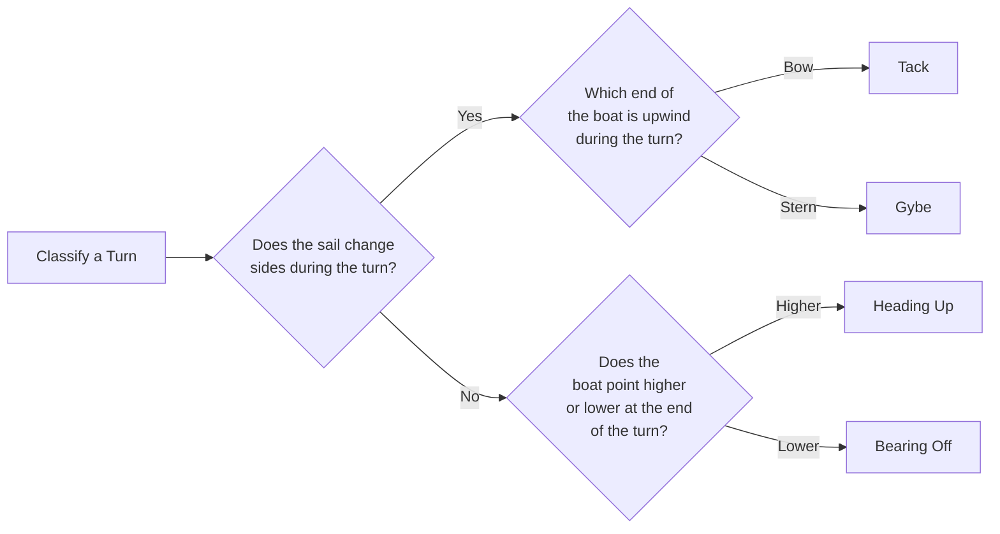
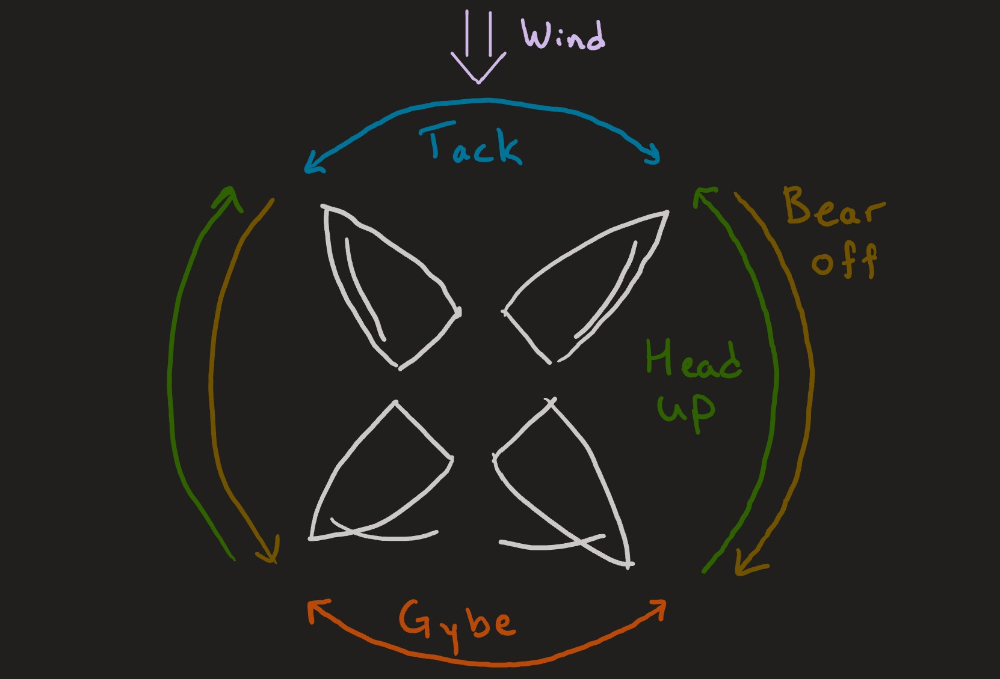
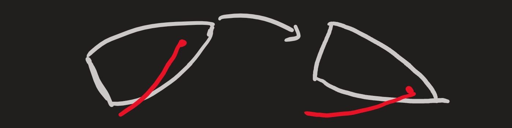
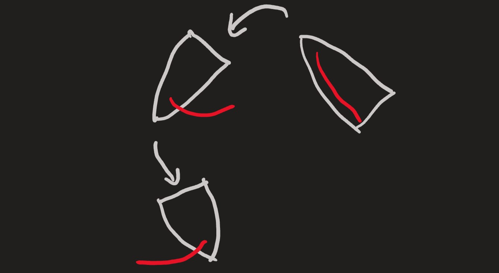

# Types of Turns

In sailing, there are 4 distinct types of turns. Read the descriptions below, and observe how they fit into the diagrams.

Note that any of these types of turn can be done in either the clockwise or counter-clockwise directions.

## Classifying Types Of Turns Summary

The following flowchart summarizes how to distinguish between different types of turns. Note:

- to point ***higher*** means to steer your boat to point in a direction closer to straight into the wind
- to point ***lower*** means to steer your boat to point in a direction closer towards to straight downwind

The diagrams in this section show outlines of the hull of a boat and its main sail going through turns.
As is common in these types of diagrams, assume that the wind is blowing down from the top of the screen unless
there is an arrow that indicates otherwise.

## Heading Up

When the boat makes any turn as follows, it is called ***Heading Up***:

- At the end of the turn, the boat is pointing *higher*.
- Throughout the turn, the sails stay on the same side of the boat. In other words, the sails do **not** cross between
the starboard and port sides.

Unlike some of the other turns listed here, heading up can be a large turn or a small course adjustment of just a few
degrees.

The image below shows a boat heading up. Notice how the sail stays on the starboard side of the boat.

## Bearing Off

When the boat makes any turn as follows, it is called ***Bearing Off***:

- At the end of the turn, the boat is pointing *lower*.
- Throughout the turn, the sails stays on the same side of the boat (port or starboard).

Like heading up, bearing off can be a small course adjustment.

## Tacking

When the boat makes any turn as follows, it is called a ***Tack*** or ***Tacking***:

- The sails change sides.
- Through the turn, the wind hits the **bow** of the boat before the stern. You can also say that the bow is *upwind* or
*windward* of the stern.

Notice how at some point throughout this turn, the boat will be pointing straight into the wind.
While the boat points nearly straight into the wind, the sails don't generate any forward propulsion.
This means that a tack must be a large (at least ~90°) turn all at once, so that the boat's momentum carries it through
the range of angles where it does not get propulsion.

## Gybing

When the boat makes any turn as follows, it is called a ***Gybe*** or ***Gybing***.

- The sails change sides.
- Through the turn, the wind hits the **stern** of the boat before the bow. You can also say that the bow of the boat is
*downwind* or *leeward* of the stern.

When sailing on most angles relative to the wind, the sail is always blown to the downwind side of the boat.
However, sailing nearly straight downwind, both sides of the boat are equally "downwind" relative to eachother.
This means that the sail can be on either side of the boat.

The sail propells the boat throughout a gybe, so it is possible to conduct the turn more gradually than a tack.
However, because the sail can be on either side, the sails can switch sides in an uncontrolled way as the boat moves in
the waves. For this reason, Raye avoids sailing on angles close to straight downwind, and gybes by doing a quick ~60°
turn.

Note that "gybe" is the spelling used in Canadian and British english, whereas in American english it is spelled "**Jibe**"

## Combinations of Turns

Of course, it is possible to do two or more of these types of turns in one continuous motion.
What two types of turns does the boat do in the image below?

Answer: In the turn shown by the first arrow, the sail stays on the port side of the boat while it steers to point further
downwind. This means that the first part of the maneuver is **bearing off**. In the next part of the maneuver, the sail
changes sides and the stern of the boat is upwind of the bow. This part of the maneuver is a **gybe**.

## Keywords on this Page

- Higher (in relation to pointing)
- Lower (in relation to pointing)
- Heading Up
- Bearing Off
- Tack
- Gybe (aka Jibe)
