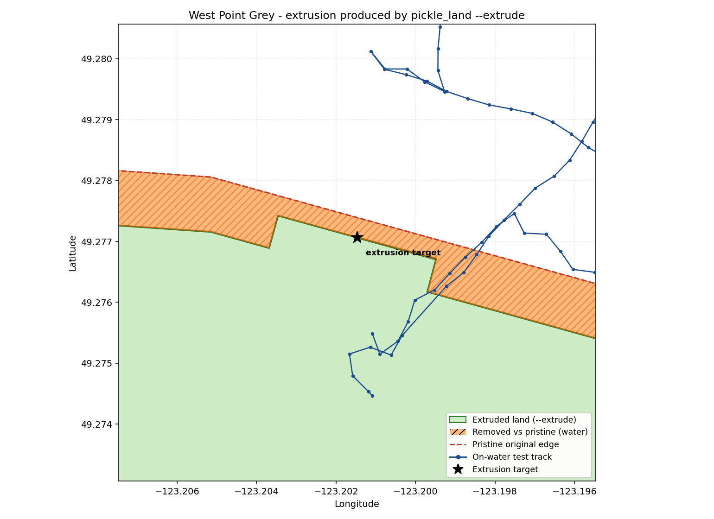

# Land Data

<!-- markdownlint-disable-next-line MD013 -->
The land data used for this project is Open Street Maps data downloaded from here: <https://osmdata.openstreetmap.de/data/land-polygons.html>

The specific dataset used is the one described with "Large polygons are split,
use for larger zoom levels"

This data may be used for ANY purpose under the Open Database License (ODbL)
v1.0. <https://www.openstreetmap.org/copyright>

<!-- markdownlint-disable MD013 -->
For on water testing land we use this data instead of using the osm land as osm land has a kilometers resolution when we need meters of resolution:
<https://opendata.vancouver.ca/explore/dataset/local-area-boundary/information/?disjunctive.name>

The land buffer at the north edge west grey is ~100 meters away from shore. This is too far for and so we should reduce the north edges by 100 meters. The reduction is reasonable however, we want to extrude a parallel land to the Jericho Pier so that individuals on the boat can deploy the software after that pier point. It ensures that the OMPL path is generated correctly and allows us to use the remaining land polygon for the land mass.

<!-- markdownlint-disable MD013 -->
The ./shp/ directory contains the shapefiles for a subset of the data from the data file downloaded from the source above. The ./shp/ data files contain only land polygons close to the shores around the pacific ocean are included, to cut down on file size.
<!-- markdownlint-enable MD013 -->

The data can be explored using Geopandas, ex:
`gdf = gpd.read_file("shp/complete_land_data.shp")`

<!-- markdownlint-disable MD013 -->
The same data stored in ./shp/ is also stored as a single Shapely Multipolygon object that is encoded into the ./pkl/land.pkl file for long term storage and easy loading into our pathfinding program during runtime.
<!-- markdownlint-enable MD013 -->

# How to run the land generation

<!-- markdownlint-disable MD013 -->
To create the land mass for either on_water testing or launch, run the following commands

- `python3 src/local_pathfinding/land/pickle_land_data.py --source production`, run this before launch
- `python3 src/local_pathfinding/land/pickle_land_data.py --source on_water`, run this before on water testing at Jericho Beach

If you want to add the extrusion (necessary for on water testing):

- `python3 src/local_pathfinding/land/pickle_land_data.py --source on_water --extrude`
<!-- markdownlint-enable MD013 -->
